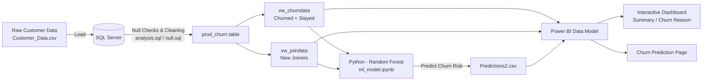

# 📉 Customer Churn Analysis & Prediction
### *An End-to-End Data Analytics Project — SQL Server • Power BI • Python (Machine Learning)*


> A complete telecom churn analytics pipeline — from raw data sitting in SQL Server, to an interactive Power BI dashboard, to a Random Forest model that predicts **which brand-new customers are at risk of leaving before they even get a chance to settle in.**

---

## 📌 Table of Contents
- [Problem Statement](#-problem-statement)
- [Project Architecture](#-project-architecture)
- [Tech Stack](#-tech-stack)
- [Dataset](#-dataset)
- [Project Workflow](#-project-workflow)
- [Power BI Dashboard](#-power-bi-dashboard)
- [Machine Learning Model](#-machine-learning-model)
- [Key Business Insights](#-key-business-insights)
- [Repository Structure](#-repository-structure)
- [How to Reproduce This Project](#-how-to-reproduce-this-project)
- [Results & Recommendations](#-results--recommendations)
- [Future Improvements](#-future-improvements)
- [About Me](#-about-me)

---

## 🎯 Problem Statement

A telecom company is losing a significant share of its customer base every period. Leadership wants to know:

1. **How many customers are churning, and what does churn actually cost the business?**
2. **Which customer segments — contract type, payment method, services, geography — are most likely to leave, and why?**
3. **Among customers who *just joined*, which ones are already showing the warning signs of churn — so retention teams can intervene early?**

This project answers all three by building a complete analytics pipeline: clean the raw data in **SQL Server**, model and visualize it in **Power BI**, then layer a **Machine Learning model** on top to proactively flag at-risk new customers.

---

## 🏗 Project Architecture



**The flow in plain English:**
`Raw Data → SQL Cleaning → SQL Views → Power BI Model → ML Prediction → Dashboard Insights`

---

## 🛠 Tech Stack

| Layer | Tool | Purpose |
|---|---|---|
| **Database / ETL** | SQL Server (T-SQL) | Data cleaning, null handling, view creation |
| **BI & Visualization** | Power BI Desktop | Data modeling, DAX measures, interactive dashboards |
| **Machine Learning** | Python (Jupyter Notebook) | Random Forest classifier for churn prediction |
| **Python Libraries** | `pandas`, `numpy`, `scikit-learn`, `matplotlib`, `seaborn`, `joblib` | Data wrangling, modeling, evaluation, visualization |
| **Data Exchange** | Excel (.xlsx) | Bridge between SQL views and Python / Power BI |

---

## 🗂 Dataset

The raw dataset (`Customer_Data.csv`) contains **6,418 customer records** across **32 attributes**, covering demographics, account information, subscribed services, billing, and churn outcome.

| Customer Status | Count | Description |
|---|---|---|
| **Stayed** | 4,275 | Active, retained customers |
| **Churned** | 1,732 | Customers who left |
| **Joined** | 411 | Brand-new customers (no churn label yet — these are the prediction targets) |

**Key attribute groups:**
- 👤 **Demographics:** Gender, Age, Married, State
- 📞 **Services:** Phone, Internet (DSL / Fiber Optic / Cable), Streaming TV/Movies/Music, Online Security/Backup, Device Protection, Premium Support
- 💳 **Account & Billing:** Contract type, Payment Method, Paperless Billing, Monthly/Total Charges, Refunds, Total Revenue
- 🚪 **Churn Outcome:** Customer Status, Churn Category, Churn Reason

---

## 🔄 Project Workflow

### 1️⃣ Data Cleaning & ETL — *SQL Server*
- Loaded the raw CSV into a `customer_data` table (schema in [`null.sql`](./null.sql)).
- Ran a full **null audit** across all 32 columns (see [`analysis.sql`](./analysis.sql)) to identify missing values in fields like `Value_Deal`, `Internet_Type`, `Churn_Category`, etc.
- Used `COALESCE()` to intelligently fill nulls (e.g., missing `Value_Deal` → `'None'`, missing `Online_Security` → `'No'`) and built a clean production table: **`prod_churn`**.
- Split `prod_churn` into two SQL **views** for downstream use:
  - **`vw_churndata`** → existing customers (`Stayed` + `Churned`) — used for *analysis* and *model training*
  - **`vw_joindata`** → new customers (`Joined`) — used for *churn prediction*

### 2️⃣ Data Modeling & Visualization — *Power BI*
- Imported both SQL views into Power BI Desktop, built a clean data model, and authored DAX measures for KPIs (Total Customers, Total Churn, Churn Rate, New Joiners, etc.).
- Designed an interactive, multi-page dashboard (details below) to let stakeholders slice churn by contract, geography, services, and payment method.

### 3️⃣ Predictive Modeling — *Python / Random Forest*
- Built a binary classification model (`Stayed` = 0, `Churned` = 1) in [`ml_model.ipynb`](./ml_model.ipynb) using `vw_churndata` as training data.
- Label-encoded all categorical features, trained a **Random Forest Classifier**, evaluated performance, and ran **feature importance analysis**.
- Applied the trained model to `vw_joindata` (the new customers) to predict **which new joiners are likely to churn**, exporting flagged accounts to [`Predictions2.csv`](./Predictions2.csv).
- Fed those predictions back into Power BI to power a dedicated **"Churn Prediction"** dashboard page.

---

## 📊 Power BI Dashboard

The `.pbix` file contains a **2-page interactive report**:

| Page | What it shows |
|---|---|
| 🟦 **Summary** | Top-level KPI cards (Total Customers, Churn Rate, New Joiners), churn breakdown by **Contract Type**, **Payment Method**, **State**, **Internet Type**, and a service-level churn pivot table |
| 🟩 **Churn Prediction** | Profile of new customers flagged as "high churn risk" by the ML model, with KPI cards and breakdowns by key attributes so retention teams know exactly who to target |


### [Summary Page]


### [Churn Prediction Page]


## 🤖 Machine Learning Model

**Algorithm:** Random Forest Classifier (`scikit-learn`, `n_estimators=100`)
**Target Variable:** `Customer_Status` (Stayed = 0, Churned = 1)
**Train/Test Split:** 80/20

### Model Performance

| Metric | Class 0 (Stayed) | Class 1 (Churned) |
|---|---|---|
| Precision | 0.85 | 0.82 |
| Recall | 0.94 | 0.62 |
| F1-Score | 0.89 | 0.71 |

**Overall Accuracy: 84%**

The model is notably strong at correctly identifying customers who will **stay** (94% recall) and reasonably precise when it flags someone as a **churn risk** (82% precision) — making it well-suited for a *proactive retention* use case where false alarms are cheaper than missed churners.

### Applying the Model to New Customers
Out of the **411 brand-new customers** in the `vw_joindata` segment, the model flagged **372 customers (~90%)** as high churn risk. These accounts were exported to `Predictions2.csv` and visualized in the Churn Prediction dashboard page — giving the business a ready-made action list for retention outreach.

---

## 🔍 Key Business Insights

> *(Derived directly from the cleaned dataset — these are the kinds of findings a stakeholder would want on slide one.)*

- 📉 **Overall churn rate is 28.8%** — nearly 1 in 3 existing customers has left.
- 💰 Churned customers represent **~$3.41M in lost total revenue**.
- 📑 **Contract type is the single biggest churn driver:** Month-to-Month customers churn at **52.4%**, vs. just **11.2%** for One-Year and **2.8%** for Two-Year contracts — locking customers into longer contracts dramatically improves retention.
- 🌐 **Fiber Optic customers churn the most (42.5%)** among internet service types, compared to DSL (20.8%) and customers with no internet service (8.9%) — worth investigating service quality or pricing for Fiber.
- 💳 **Payment method matters:** customers paying by **Mailed Check churn at 42.9%**, vs. **16.2%** for Credit Card — manual payment friction may be linked to disengagement.
- 🏆 **Top churn category is "Competitor"** (761 customers), driven mainly by *"better devices"* and *"better offers"* — this is a competitive retention problem, not just a service-quality one.
- 😠 **Customer service matters:** "Attitude of support person" is the #1 specific churn *reason* after competitor offers, accounting for 208 lost customers — a clear, fixable internal lever.

---

## 📁 Repository Structure

```
Customer-Churn-Analysis-Prediction/
│
├── README.md                                  # You are here
├── Customer_Data.csv                           # Raw source data (6,418 records)
│
├── sql/
│   ├── null.sql                                # Table schema + raw table creation
│   └── analysis.sql                            # Null audit, data cleaning, view creation
│
├── powerbi/
│   ├── Customer_Churn_Analysis___Prediction.pbix   # Power BI dashboard (3 pages)
│   └── prediction_data.xlsx                    # Excel bridge file (SQL views → Power BI/Python)
│
├── ml/
│   ├── ml_model.ipynb                          # Random Forest training + prediction notebook
│   └── Predictions2.csv                        # Output: new joiners flagged as churn risks
│
└── views/
    ├── vw_churndata.csv                        # Exported view: Stayed + Churned customers
    └── vw_joindata.csv                         # Exported view: New joiners
```

> 💡 The folder layout above (`sql/`, `powerbi/`, `ml/`, `views/`) is a suggested structure — organizing your repo this way before pushing to GitHub instantly makes it look more professional and easier to navigate.

---

## ⚙️ How to Reproduce This Project

1. **Set up the database**
   ```sql
   -- Run in SQL Server Management Studio
   :r null.sql        -- creates the customer_data table & schema
   -- Import Customer_Data.csv into the customer_data table
   :r analysis.sql     -- runs null checks, cleaning, and creates prod_churn + views
   ```
2. **Export views** `vw_churndata` and `vw_joindata` to Excel/CSV for use in Power BI and Python.
3. **Open the Power BI report**
   - Launch `Customer_Churn_Analysis___Prediction.pbix` in Power BI Desktop.
   - Point the data source to your exported views/Excel file.
4. **Run the ML model**
   ```bash
   pip install pandas numpy scikit-learn matplotlib seaborn joblib openpyxl
   jupyter notebook ml_model.ipynb
   ```
   - Run all cells to train the Random Forest model on `vw_churndata` and generate predictions on `vw_joindata`.
5. **Refresh Power BI** with the new `Predictions2.csv` to update the Churn Prediction page.

---

## ✅ Results & Recommendations

| Finding | Recommended Action |
|---|---|
| Month-to-Month contracts churn 4–18x more than longer contracts | Offer incentives (discounts, bundled perks) to migrate Month-to-Month customers onto 1–2 year contracts |
| Competitor offers are the #1 churn category | Build a competitive intelligence loop and proactive retention offers for at-risk segments |
| Fiber Optic users churn at the highest rate by service type | Audit Fiber Optic service quality, pricing, and support experience |
| Support attitude is a top-5 churn reason | Invest in customer service training / QA for support interactions |
| 372 new customers are already flagged as high-risk | Trigger an immediate retention/onboarding campaign for the customers in `Predictions2.csv` |

---

## 🚀 Future Improvements

- Address class imbalance (only ~29% of training data is "Churned") using SMOTE or class-weighting to improve recall on the churn class.
- Experiment with additional models (XGBoost, Logistic Regression, Gradient Boosting) and compare against the Random Forest baseline.
- Add a What-If / scenario-analysis page in Power BI so business users can simulate retention strategies.
- Automate the SQL → Python → Power BI refresh pipeline (e.g., via Power BI dataflows or a scheduled script).
- Deploy the model as a lightweight API/web app for real-time churn scoring of new customers.

---

## 👤 About Me

This project was built end-to-end as a **Data Analyst portfolio project**, covering the full analytics lifecycle: **SQL → Power BI → Machine Learning → Business Storytelling.**

*Methodology inspired by the "Power BI End-to-End Churn Analysis" tutorial — adapted and rebuilt independently with my own data exploration, SQL cleaning logic, and insight narrative.*

📧 **Feel free to connect with me for feedback, questions, or opportunities!**

⭐ If you found this project useful or interesting, consider giving it a star on GitHub!
