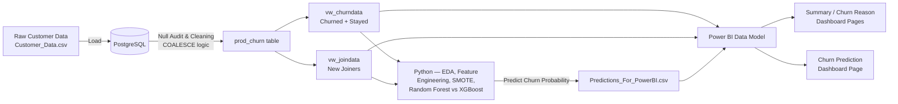

# 📉 Customer Churn Analysis & Prediction
### *An End-to-End Data Analytics Project — PostgreSQL • Power BI • Python (Machine Learning)*


> A complete telecom churn analytics pipeline — from raw data sitting in PostgreSQL, to an interactive Power BI dashboard, to a Random Forest model that predicts **which brand-new customers are at risk of leaving before they even get a chance to settle in.**

---

## 📌 Table of Contents
- [Problem Statement](#-problem-statement)
- [Project Architecture](#-project-architecture)
- [Tech Stack](#-tech-stack)
- [Dataset](#-dataset)
- [Project Workflow](#-project-workflow)
- [Power BI Dashboard](#-power-bi-dashboard)
- [Machine Learning Model](#-machine-learning-model)
- [Key Business Insights](#-key-business-insights)
- [Repository Structure](#-repository-structure)
- [How to Reproduce This Project](#-how-to-reproduce-this-project)
- [Results & Recommendations](#-results--recommendations)
- [Future Improvements](#-future-improvements)
- [About Me](#-about-me)

---

## 🎯 Problem Statement

A telecom company is losing a significant share of its customer base every period. Leadership wants to know:

1. **How many customers are churning, and what does churn actually cost the business?**
2. **Which customer segments — contract type, payment method, services, geography — are most likely to leave, and why?**
3. **Among customers who *just joined*, which ones are already showing the warning signs of churn — so retention teams can intervene early?**

This project answers all three by building a complete analytics pipeline: clean the raw data in **PostgreSQL**, model and visualize it in **Power BI**, then layer a **Machine Learning model** on top to proactively flag at-risk new customers with a calibrated risk score, not just a yes/no flag.

---

## 🏗 Project Architecture



**The flow in plain English:**
`Raw Data → SQL Cleaning (verified, not assumed) → SQL Views → Python EDA & Modeling → Predictions with Probability → Power BI Data Model → Dashboard Insights`

---

## 🛠 Tech Stack

| Layer | Tool | Purpose |
|---|---|---|
| **Database / ETL** | PostgreSQL | Data cleaning, null handling (`COALESCE`), view creation |
| **BI & Visualization** | Power BI Desktop | Data modeling, DAX measures, interactive dashboards |
| **Machine Learning** | Python (Jupyter Notebook) | Random Forest & XGBoost comparison for churn prediction |
| **Python Libraries** | `pandas`, `numpy`, `scikit-learn`, `xgboost`, `imbalanced-learn`, `matplotlib`, `seaborn` | Data wrangling, EDA, class-imbalance handling, modeling, evaluation |
| **Data Exchange** | Excel (.xlsx) / CSV | Bridge between SQL views and Python / Power BI |

---

## 🗂 Dataset

The raw dataset (`Customer_Data.csv`) contains **6,418 customer records** across **32 attributes**, covering demographics, account information, subscribed services, billing, and churn outcome.

| Customer Status | Count | Description |
|---|---|---|
| **Stayed** | 4,275 | Active, retained customers |
| **Churned** | 1,732 | Customers who left |
| **Joined** | 411 | Brand-new customers (no churn label yet — these are the prediction targets) |

**Key attribute groups:**
- 👤 **Demographics:** Gender, Age, Married, State
- 📞 **Services:** Phone, Internet (DSL / Fiber Optic / Cable), Streaming TV/Movies/Music, Online Security/Backup, Device Protection, Premium Support
- 💳 **Account & Billing:** Contract type, Payment Method, Paperless Billing, Monthly/Total Charges, Refunds, Total Revenue
- 🚪 **Churn Outcome:** Customer Status, Churn Category, Churn Reason

---

## 🔄 Project Workflow

### 1️⃣ Data Cleaning & ETL — *PostgreSQL*
- Loaded the raw CSV into a `customer_data` table (schema in [`SQL_Queries.sql`](./SQL_Queries.sql)).
- Ran a full **null audit** across all 32 columns to identify missing values in fields like `Value_Deal`, `Internet_Type`, `Churn_Category`, etc. — these turned out to be *structural* nulls (e.g. a customer with no internet service naturally has no `Internet_Type`), not random gaps.
- Used `COALESCE()` to intelligently fill nulls (e.g., missing `Value_Deal` → `'None'`, missing `Online_Security` → `'No'`) and built a clean production table: **`prod_churn`**.
- Added an explicit **verification step** after every rebuild — `SELECT SUM(CASE WHEN col IS NULL THEN 1 ELSE 0 END) ...` on the cleaned table — so a broken export is caught immediately instead of surfacing downstream in Python or Power BI.
- Split `prod_churn` into two SQL **views**:
  - **`vw_churndata`** → existing customers (`Stayed` + `Churned`) — used for *analysis* and *model training*
  - **`vw_joindata`** → new customers (`Joined`) — used for *churn prediction*

### 2️⃣ Predictive Modeling — *Python*
- Ran EDA on `vw_churndata` first — distribution checks, a correlation heatmap, and churn-rate-by-category breakdowns — before touching any modeling code.
- Engineered new features beyond the raw columns: `Total_Services` (bundle depth), `Revenue_Per_Month`, and `Has_Promo`.
- Used a **stratified train/test split** and applied **SMOTE on the training set only** to address the ~29%/71% class imbalance, without leaking synthetic data into evaluation.
- Compared three models — **Logistic Regression, Random Forest, and XGBoost** — using stratified 5-fold cross-validation, scored on **recall** rather than accuracy, since a missed churner is costlier to the business than a false alarm.
- Selected **Random Forest** (best balance of recall and interpretability), evaluated with a confusion matrix, classification report, ROC-AUC, and both built-in and permutation feature importance.
- Applied the trained model to `vw_joindata` (the new customers), producing not just a binary flag but a **churn probability per customer**, exported to `Predictions_For_PowerBI.csv`.

### 3️⃣ Data Modeling & Visualization — *Power BI*
- Imported the SQL views and the model's predictions into Power BI Desktop, built a clean data model, and authored DAX measures for KPIs (Total Predicted Churners, High-Risk Customers, Average Churn Probability, etc.).
- Designed an interactive, multi-page dashboard (details below) to let stakeholders slice churn by contract, geography, services, and payment method — and, on the prediction page, sort the at-risk list by churn probability rather than treating every flagged customer as equally urgent.

---

## 📊 Power BI Dashboard

The `.pbix` file contains a **2-page interactive report**:

| Page | What it shows |
|---|---|
| 🟦 **Summary** | Top-level KPI cards (Total Customers, Churn Rate, New Joiners), churn breakdown by **Contract Type**, **Payment Method**, **State**, **Internet Type**, and a service-level churn pivot table |
| 🟨 **Churn Reason** | Breakdown of *why* customers who already left actually churned — category and reason-level detail for root-cause analysis |
| 🟩 **Churn Prediction** | Profile of new customers flagged as churn risk by the ML model, with demographic breakdowns, a churn-probability-ranked "Customers at Risk" table, and revenue/monthly-charge exposure so retention teams know exactly who to target first |

### [Summary Page]


### [Churn Prediction Page]


---

## 🤖 Machine Learning Model

**Algorithms compared:** Logistic Regression, Random Forest, XGBoost (`scikit-learn` / `xgboost`)
**Final model:** Random Forest Classifier (`n_estimators=200`, `max_depth=12`)
**Target Variable:** `Customer_Status` (Stayed = 0, Churned = 1)
**Train/Test Split:** 80/20, **stratified** on the target
**Class Imbalance:** Addressed with **SMOTE**, applied to the training set only

### Model Performance

| Metric | Class 0 (Stayed) | Class 1 (Churned) |
|---|---|---|
| Precision | 0.89 | 0.72 |
| Recall | 0.88 | 0.74 |
| F1-Score | 0.89 | 0.73 |

**Overall Accuracy: 84% · ROC-AUC: 0.888**

Model selection was based on **recall on the churn class**, not accuracy — in a retention use case, a missed churner (false negative) costs the business a customer it never got the chance to save, which is a more expensive mistake than a false alarm. Cross-validated recall across candidates: **Random Forest 0.888, XGBoost 0.883, Logistic Regression 0.836.**

### Applying the Model to New Customers
Out of the **411 brand-new customers** in the `vw_joindata` segment, the model flagged **380 customers (~92%)** as churn risk, each with an individual **churn probability score** rather than just a binary label. These accounts were exported to `Predictions_For_PowerBI.csv` and visualized in the Churn Prediction dashboard page, sorted by risk — giving the business a prioritized, ready-made action list for retention outreach, representing **$43,246 in monthly-charge exposure** and a meaningful share of near-term revenue at risk.

---

## 🔍 Key Business Insights

> *(Derived directly from the cleaned, verified dataset — these are the kinds of findings a stakeholder would want on slide one.)*

- 📉 **Overall churn rate is 28.8%** — nearly 1 in 3 existing customers has left.
- 💰 Churned customers represent **~$3.41M in lost total revenue**.
- 📑 **Contract type is the single biggest churn driver:** Month-to-Month customers churn at **52.4%**, vs. just **11.2%** for One-Year and **2.8%** for Two-Year contracts — locking customers into longer contracts dramatically improves retention.
- 🌐 **Fiber Optic customers churn the most (42.5%)** among internet service types, compared to Cable (27.6%) and DSL (20.8%) — worth investigating service quality or pricing for Fiber specifically.
- 💳 **Payment method matters:** customers paying by **Mailed Check churn at 42.9%**, vs. **16.2%** for Credit Card — manual payment friction may be linked to disengagement.
- 🏆 **Top churn category is "Competitor"** (761 customers), driven mainly by *better devices* and *better offers* — this is a competitive retention problem, not just a service-quality one.
- 😠 **Customer service matters:** "Attitude of support person" is the top specific churn *reason* after competitor offers, accounting for 208 lost customers — a clear, internally fixable lever.

---

## 📁 Repository Structure

```
Customer-Churn-Analysis-Prediction/
│
├── README.md                                  # You are here
├── Customer_Data.csv                           # Raw source data (6,418 records)
│
├── sql/
│   └── SQL_Queries.sql                         # Table schema, null audit, COALESCE cleaning, view creation + verification checks
│
├── powerbi/
│   ├── Customer_Churn_Analysis___Prediction.pbix   # Power BI dashboard (3 pages)
│   └── prediction_for_python.xlsx              # Excel bridge file (SQL views → Power BI/Python)
│
├── ml/
│   ├── ml_model.ipynb                          # EDA, feature engineering, SMOTE, model comparison, training + prediction notebook
│   ├── customer_churn_model.pkl                # Saved trained model + encoders
│   └── Predictions_For_PowerBI.csv             # Output: new joiners flagged as churn risks, with probability score
│
└── views/
    ├── vw_churndata.csv                        # Exported view: Stayed + Churned customers
    └── vw_joindata.csv                         # Exported view: New joiners
```

> 💡 The folder layout above (`sql/`, `powerbi/`, `ml/`, `views/`) is a suggested structure — organizing your repo this way before pushing to GitHub instantly makes it look more professional and easier to navigate.

---

## ⚙️ How to Reproduce This Project

1. **Set up the database**
   ```sql
   -- Run in your PostgreSQL client (pgAdmin, psql, etc.), top to bottom, in order
   -- SQL_Queries.sql:
   --   1. CREATE TABLE customer_data (...)
   --   2. Import Customer_Data.csv into customer_data
   --   3. Run the null audit block
   --   4. DROP TABLE IF EXISTS prod_churn; then rebuild it with the COALESCE block
   --   5. VERIFY: SELECT SUM(CASE WHEN value_deal IS NULL ...) FROM prod_churn;
   --      -> every column must return 0 before continuing
   --   6. Create vw_churndata and vw_joindata views
   --   7. Re-run the verification query against both views before exporting anything
   ```
2. **Export views** `vw_churndata` and `vw_joindata` to Excel/CSV — always from a freshly-run query result, not a cached grid/tab — for use in Power BI and Python.
3. **Run the ML model**
   ```bash
   pip install pandas numpy scikit-learn xgboost imbalanced-learn matplotlib seaborn openpyxl
   jupyter notebook ml_model.ipynb
   ```
   - Run all cells to explore, engineer features, train and compare models on `vw_churndata`, and generate probability-scored predictions on `vw_joindata`.
4. **Open the Power BI report**
   - Launch `Customer_Churn_Analysis___Prediction.pbix` in Power BI Desktop.
   - Point the data source to your exported views and the fresh `Predictions_For_PowerBI.csv`.
5. **Refresh Power BI** to update all three dashboard pages with the latest data and predictions.

---

## ✅ Results & Recommendations

| Finding | Recommended Action |
|---|---|
| Month-to-Month contracts churn 4–18x more than longer contracts | Offer incentives (discounts, bundled perks) to migrate Month-to-Month customers onto 1–2 year contracts |
| Competitor offers are the #1 churn category | Build a competitive intelligence loop and proactive retention offers for at-risk segments |
| Fiber Optic users churn at the highest rate by service type | Audit Fiber Optic service quality, pricing, and support experience |
| Support attitude is a top churn reason | Invest in customer service training / QA for support interactions |
| 380 new customers are already flagged as churn risk, ranked by probability | Trigger a prioritized retention/onboarding campaign starting with the highest-probability accounts in `Predictions_For_PowerBI.csv` |

---

## 🚀 Future Improvements

- Replace label encoding on nominal fields (`State`, `Contract`, `Payment_Method`) with one-hot or target encoding, since these categories have no true numeric order.
- Add a What-If / scenario-analysis page in Power BI so business users can simulate retention strategies.
- Automate the SQL → Python → Power BI refresh pipeline end to end (e.g., via a scheduled script or Power BI dataflows) so a fresh data pull always produces a fresh, verified prediction set.
- Incorporate behavioral/time-series signals (usage trend, complaint tickets) if the source system captures them — the current model is trained entirely on a static snapshot.
- Deploy the model as a lightweight API/web app for real-time churn scoring of new customers.

---

## 👤 About Me

This project was built end-to-end as a **Data Analyst portfolio project**, covering the full analytics lifecycle: **SQL → Python (Machine Learning) → Power BI → Business Storytelling** — including real debugging along the way (a data-cleaning handoff bug between SQL and the export layer, and a subtle "None"-as-missing-value parsing issue) that shaped the final, verified pipeline.

*Methodology inspired by the "Power BI End-to-End Churn Analysis" tutorial — adapted and rebuilt independently with my own data exploration, SQL cleaning logic, model comparison, and insight narrative.*

📧 **Feel free to connect with me for feedback, questions, or opportunities!**

⭐ If you found this project useful or interesting, consider giving it a star on GitHub!
